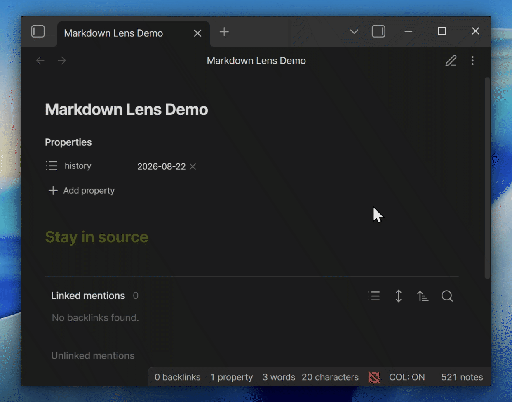

# Markdown Lens

[English](./README.md) | [한국어](./README_KO.md) | [简体中文](./README_CN.md)

Markdown is easiest to control when its syntax stays visible. Markdown Lens keeps **Source mode** as the main workspace and opens a small rendered view around the cursor—without switching modes or hiding the source.

- Renders the whole note, preserving links, math, images, code blocks, callouts, and embeds.
- Tracks the current source line or selection in the rendered view.
- Also works in Canvas text nodes and restores normal image paste there.

## Use

Enable the plugin, switch a note to **Source mode**, and place the cursor in the text. Lens and image height can be adjusted in the plugin settings.

Until it reaches the Community directory, install it with BRAT from `https://github.com/philaxis/markdown-lens`.

Desktop only. No account, ads, or telemetry; note content is not transmitted. Closed source; personal and internal business use is allowed under the [commercial license](./LICENSE).
